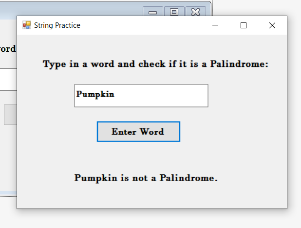
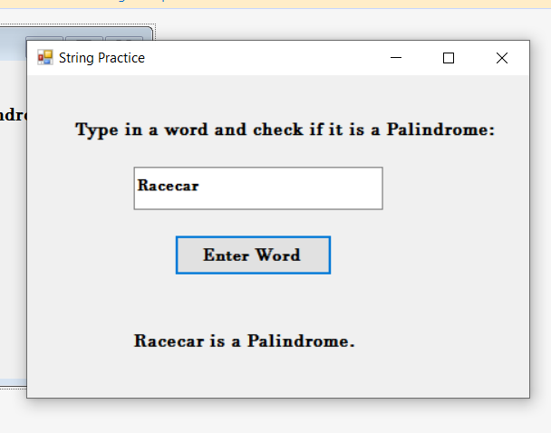

# Palindrome-Checker-C-
This program is a Windows Forms application created in C#. It will check whether an entered word is a palindrome or not. A Palindrome is a word that is the same backwards.

This app allows you to enter a string and it will render text stating if the string is a palindrome or not.

